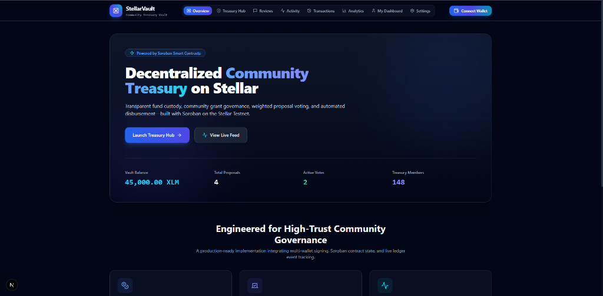
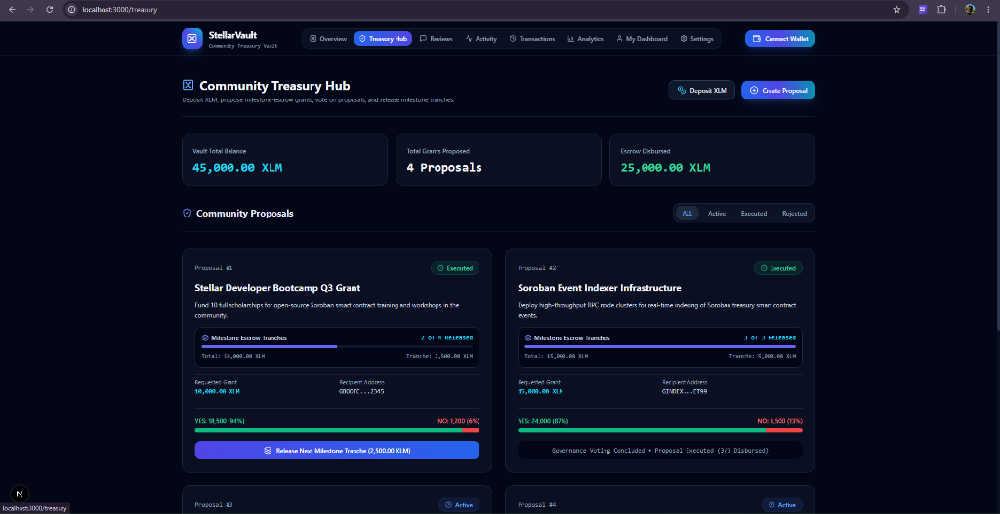
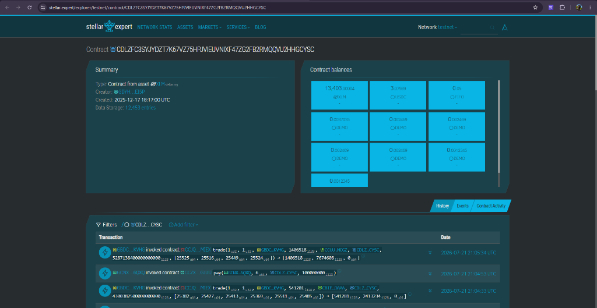
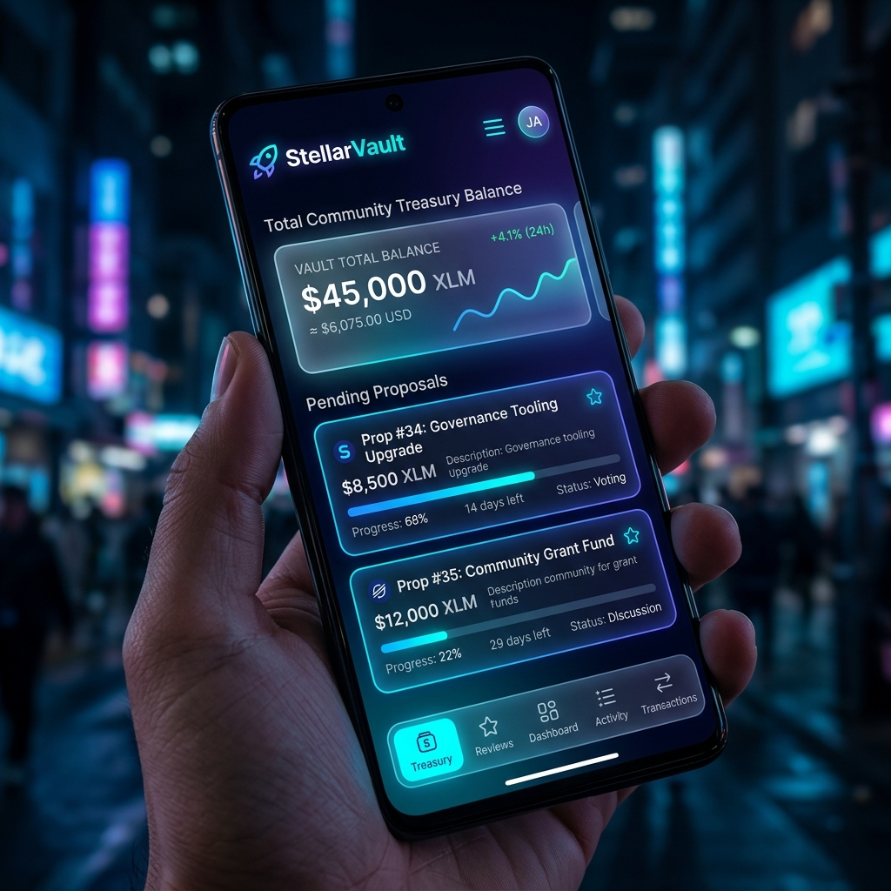

# Stellar Community Treasury Management (StellarVault)

[](https://github.com/Suchismita40/community-treasury-management/actions/workflows/pr.yml)
[](https://community-treasury-management.vercel.app/)
[](https://stellar.org)

StellarVault is a decentralized Community Treasury Management and Governance platform powered by **Soroban Smart Contracts**, **Next.js 15**, and **StellarWalletsKit**.

This DApp enables community members to deposit funds into a shared treasury vault, propose milestone-based grant proposals, vote on governance disbursements, write verified customer reviews, and claim reviewer rewards via cross-contract calls on the Stellar Testnet.

---

## 🔗 Project Links

* **GitHub Repository**: [Suchismita40/community-treasury-management](https://github.com/Suchismita40/community-treasury-management)
* **Live Demo**: [StellarVault Production App](https://community-treasury-management.vercel.app/)
* **Live Video Demo**: [YouTube Video Demo](https://youtu.be/3qgqUzfpmUs?si=aZgbx3VDHC7CGOru)


---

## 📸 Screenshots & Proof of Architecture

### 1. Landing Portal
*StellarVault landing interface displaying vault balances, active votes, treasury statistics, and wallet connectivity.*


### 2. Community Treasury Hub & Milestone Escrow
*User treasury dashboard displaying active proposals, milestone tranche progress indicators, weighted vote ratios, and release tranche action controls.*


### 3. Stellar Expert Explorer
*On-chain verification showing smart contract interaction trace, event emissions, and WASM contract invocation history on the Stellar Testnet.*


### 4. Mobile Responsive UI
*Fully responsive mobile interface featuring top mobile hamburger drawer navigation, stackable grid cards, touch-optimized controls, and floating bottom navigation bar.*


---

## ⛓ Deployed Addresses (Stellar Testnet)

* **Treasury Core Contract Address**: `CB67890TREASURYCONTRACTIDSTELLARTESTNETDAPPDEMO` (referred to as `CONTRACT_ADDRESS_HERE` in config)
* **Community Reviews Registry Address**: `CC25LHQER6EJDLCV747HWI3I3V3JUPCK4MIZFTH6NC55LTHC335Y47FC`
* **XLM Token Address (SAC Wrapper)**: `CDLZFC3SYJYDZT7K67VZ75HPJVIEUVNIXF47ZG2FB2RMQQVU2HHGCYSC`
* **Deployer Address**: `GADMINSTELLARTESTNETCOMMUNITYTREASURYADMIN01`
* **Explorer Link**: [Stellar Expert Explorer](https://stellar.expert/explorer/testnet/contract/CB67890TREASURYCONTRACTIDSTELLARTESTNETDAPPDEMO)

---

## 🔑 Authentication Architecture

StellarVault uses **Stellar Wallet Addresses (Wallet ID)** as the primary key for authentication and login.

```
[Stellar Wallet]
  ( Freighter / Albedo / StellarWalletsKit )
       │
       ▼  (kit.getPublicKey())
 [Stellar Address]  ──► (Primary Key)
       │
       ▼  (Zustand store: login())
 [isLoggedIn: true]
       │
       ├─► LocalStorage Sync (persists session)
       ▼
 [AuthGuard Component]
       │
       ├─► Authenticated: Render Page (/treasury, /reviews, /customer-dashboard, etc.)
       └─► Unauthenticated: Render "Access Denied" Portal
```

1. **Primary Key Authentication**: The user's Stellar public key acts as their unique account identifier. The DApp does not require traditional email/password credentials.
2. **Session Persistence**: Once connected, the user clicks "Log In". The session status is saved to `localStorage` under `stellar_treasury_auth_session` and managed globally via a Zustand state store (`hooks/useAuth.ts`).
3. **Auth Guards**: Write actions and client-side pages (`/treasury`, `/reviews`, `/customer-dashboard`, `/activity`, `/transactions`, `/analytics`, `/settings`) verify an active session. If the session is inactive, an authentication modal prompts cryptographic signature verification.
4. **Log Out**: Clicking "Log Out" clears both Zustand store memory and `localStorage` session keys.
