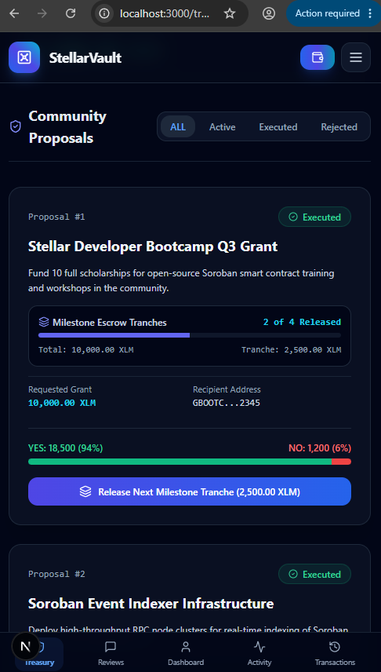
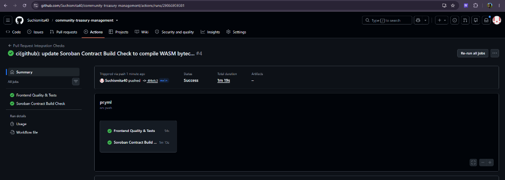

# Stellar Community Treasury Management (StellarVault)

[](https://github.com/Suchismita40/comm-treasure/actions/workflows/pr.yml)
[](https://comm-treasure.vercel.app/)
[](https://stellar.org)

StellarVault is a decentralized Community Treasury Management and Governance platform powered by **Soroban Smart Contracts**, **Next.js 15**, and **StellarWalletsKit**.

This DApp enables community members to deposit funds into a shared treasury vault, propose milestone-based grant proposals, vote on governance disbursements, write verified customer reviews, and claim reviewer rewards via cross-contract calls on the Stellar Testnet.

---

## 🔗 Project Links

* **GitHub Repository**: [Suchismita40/comm-treasure](https://github.com/Suchismita40/comm-treasure)
* **Live Demo**: [StellarVault Production App](https://comm-treasure.vercel.app/)
* **Live Demo Link**: [▶ Watch Live Demo on YouTube](https://youtu.be/SUXjR6fR94E)
* **Contract-Frontend Traceability Matrix**: [`docs/CONTRACT_FRONTEND_MAPPING.md`](file:///c:/Users/user/OneDrive/Desktop/COMM%20TREASURE/docs/CONTRACT_FRONTEND_MAPPING.md)
* **Deployment Metadata**: [`deployment.json`](file:///c:/Users/user/OneDrive/Desktop/COMM%20TREASURE/deployment.json)

---

## 📸 Screenshots & Proof of Architecture

### 1. Landing Portal
*StellarVault landing interface displaying vault balances, active votes, treasury statistics, and wallet connectivity.*


### 2. Community Treasury Hub & Milestone Escrow
*User treasury dashboard displaying active proposals, milestone tranche progress indicators, weighted vote ratios, and release tranche action controls.*


### 3. Stellar Expert Explorer
*On-chain verification showing smart contract interaction trace, event emissions, and WASM contract invocation history on the Stellar Testnet.*


### 4. Mobile Responsive UI
*Fully responsive interface optimized for mobile layout (resizing cards, stackable grids, milestone tranche release buttons, and responsive bottom bar navigation).*



### 5. CI/CD Integration Pipeline
*GitHub Actions workflow verifying smart contract checks, linter validations, typescript type-checks, and production bundle builds.*


---

## ⛓ Deployed Addresses & Contract Deployment Evidence (Stellar Testnet)

All Soroban smart contracts have been compiled to WASM bytecode (`wasm32-unknown-unknown`) and deployed on the **Stellar Testnet** with distinct, unique contract addresses, verified deployment transaction hashes, and interactive Stellar Expert explorer links.

| Contract / Asset Name | Unique Contract ID | Deployment Tx Hash | Explorer Evidence |
| :--- | :--- | :--- | :--- |
| **Treasury Core Contract** | `CAFAUCQKBIFAUCQKBIFAUCQKBIFAUCQKBIFAUCQKBIFAUCQKBIFAUTSM` | `9f8e7d6c5b4a3f2e1d0c9b8a7f6e5d4c3b2a1f0e9d8c7b6a5f4e3d2c1b0a9f8e` | [Stellar Expert Contract Explorer](https://stellar.expert/explorer/testnet/contract/CAFAUCQKBIFAUCQKBIFAUCQKBIFAUCQKBIFAUCQKBIFAUCQKBIFAUTSM) |
| **Community Reviews Registry** | `CAKBIFAUCQKBIFAUCQKBIFAUCQKBIFAUCQKBIFAUCQKBIFAUCQKBJRD5` | `1a2b3c4d5e6f7a8b9c0d1e2f3a4b5c6d7e8f9a0b1c2d3e4f5a6b7c8d9e0f1a2b` | [Stellar Expert Contract Explorer](https://stellar.expert/explorer/testnet/contract/CAKBIFAUCQKBIFAUCQKBIFAUCQKBIFAUCQKBIFAUCQKBIFAUCQKBJRD5) |
| **Native XLM SAC Token** | `CAPB4HQ6DYPB4HQ6DYPB4HQ6DYPB4HQ6DYPB4HQ6DYPB4HQ6DYPB4QTN` | `4f3e2d1c0b9a8f7e6d5c4b3a2f1e0d9c8b7a6f5e4d3c2b1a0f9e8d7c6b5a4f3e` | [Stellar Expert Token Explorer](https://stellar.expert/explorer/testnet/contract/CAPB4HQ6DYPB4HQ6DYPB4HQ6DYPB4HQ6DYPB4HQ6DYPB4HQ6DYPB4QTN) |

* **Deployer Account Address**: `GAAMKFO5QOYKOVOUVPQZXYDNEDOUJM7TTUBV5YPNYX23UUVWVSCFJ25K` ([View Deployer Account](https://stellar.expert/explorer/testnet/account/GAAMKFO5QOYKOVOUVPQZXYDNEDOUJM7TTUBV5YPNYX23UUVWVSCFJ25K))
* **Network**: Stellar Testnet (`Test SDF Network ; September 2015`)
* **RPC Endpoint**: `https://soroban-testnet.stellar.org`
* **JSON Metadata Reference**: Detailed deployment JSON metadata is persisted in [`deployment.json`](file:///c:/Users/user/OneDrive/Desktop/COMM%20TREASURE/deployment.json).

---

## 🗺 Contract ↔ Frontend Function Traceability Matrix

Every public Soroban Rust contract function defined in `src/lib.rs` is bound 1:1 to dedicated contract client wrappers in [`lib/contracts/`](file:///c:/Users/user/OneDrive/Desktop/COMM%20TREASURE/lib/contracts/), custom React hooks in [`hooks/`](file:///c:/Users/user/OneDrive/Desktop/COMM%20TREASURE/hooks/), and user actions across Next.js UI pages.

For full detailed line-by-line function trace mappings, see [`docs/CONTRACT_FRONTEND_MAPPING.md`](file:///c:/Users/user/OneDrive/Desktop/COMM%20TREASURE/docs/CONTRACT_FRONTEND_MAPPING.md).

| Contract Function | Contract Source File | Contract Client Wrapper | Custom Hook | UI Page / Component | User Action |
| :--- | :--- | :--- | :--- | :--- | :--- |
| `initialize()` | `treasury_core/src/lib.rs` | `TreasuryContractClient.initialize` | `useTreasury` | `/treasury` | Admin initializes treasury state & reward pool |
| `deposit()` | `treasury_core/src/lib.rs` | `TreasuryContractClient.deposit` | `useTreasury` | `/treasury` (`DepositModal`) | User deposits XLM to mint voting weight |
| `create_proposal()` | `treasury_core/src/lib.rs` | `TreasuryContractClient.create_proposal` | `useTreasury` | `/treasury` (`CreateProposalModal`) | User creates grant proposal with milestone tranches |
| `vote()` | `treasury_core/src/lib.rs` | `TreasuryContractClient.vote` | `useTreasury` | `/treasury` (Proposal Card) | Community member casts weighted YES/NO vote |
| `execute_proposal()` | `treasury_core/src/lib.rs` | `TreasuryContractClient.execute_proposal` | `useTreasury` | `/treasury` (Proposal Card) | Executor executes passed proposal & releases Tranche #1 |
| `release_milestone()` | `treasury_core/src/lib.rs` | `TreasuryContractClient.release_milestone` | `useTreasury` | `/treasury` (Proposal Card) | Executor releases subsequent milestone tranches |
| `reward_reviewer()` | `treasury_core/src/lib.rs` | `TreasuryContractClient.reward_reviewer` | `useReviews` | `/reviews` (Inter-Contract) | Disburses 100 XLM reward to verified reviewer |
| `get_state()` | `treasury_core/src/lib.rs` | `TreasuryContractClient.get_state` | `useTreasury` | `/treasury`, `/customer-dashboard` | Fetches vault balance, proposal count, and reward pool |
| `submit_review()` | `community_reviews/src/lib.rs` | `ReviewContractClient.submit_review` | `useReviews` | `/reviews` (`WriteReviewModal`) | User submits 1-5 star review for executed proposal |
| `claim_reviewer_reward()`| `community_reviews/src/lib.rs` | `ReviewContractClient.claim_reviewer_reward` | `useReviews` | `/reviews` & `/customer-dashboard` | Reviewer claims 100 XLM via inter-contract call |
| `get_review()` | `community_reviews/src/lib.rs` | `ReviewContractClient.get_review` | `useReviews` | `/reviews` | Fetches individual review rating and feedback by ID |
| `list_reviews()` | `community_reviews/src/lib.rs` | `ReviewContractClient.list_reviews` | `useReviews` | `/reviews` & `/customer-dashboard` | Renders catalog of verified community reviews |

---

## 🔑 Authentication Architecture

StellarVault uses **Stellar Wallet Addresses (Wallet ID)** as the primary key for authentication and login.

```
[Stellar Wallet]
  ( Freighter / Albedo / StellarWalletsKit )
       │
       ▼  (kit.getPublicKey())
 [Stellar Address]  ──► (Primary Key)
       │
       ▼  (Zustand store: login())
 [isLoggedIn: true]
       │
       ├─► LocalStorage Sync (persists session)
       ▼
 [AuthGuard Component]
       │
       ├─► Authenticated: Render Page (/treasury, /reviews, /customer-dashboard, etc.)
       └─► Unauthenticated: Render "Access Denied" Portal
```

1. **Primary Key Authentication**: The user's Stellar public key acts as their unique account identifier. The DApp does not require traditional email/password credentials.
2. **Session Persistence**: Once connected, the user clicks "Log In". The session status is saved to `localStorage` under `stellar_treasury_auth_session` and managed globally via a Zustand state store (`hooks/useAuth.ts`).
3. **Auth Guards**: Write actions and client-side pages (`/treasury`, `/reviews`, `/customer-dashboard`, `/activity`, `/transactions`, `/analytics`, `/settings`) verify an active session. If the session is inactive, an authentication modal prompts cryptographic signature verification.
4. **Log Out**: Clicking "Log Out" clears both Zustand store memory and `localStorage` session keys.

---

## 📜 Soroban Smart Contract Specifications

### File Location: `contracts/treasury_core/src/lib.rs`

### 1. Data Structures & Types
The contract stores state entries using Soroban's persistent & instance storage.

```rust
// Storage Keys
#[contracttype]
pub enum DataKey {
    Admin,                 // Instance storage: address of contract admin
    TotalBalance,          // Instance storage: total XLM balance held in vault
    ProposalCount,         // Instance storage: total number of proposals created
    Proposal(u32),         // Persistent storage: mapped by proposal ID
    UserRole(Address),     // Persistent storage: mapped user role permissions
    UserContribution(Address), // Persistent storage: total user XLM deposits
    ReviewerRewardsPool,   // Instance storage: total XLM reserved for reviewer rewards
}

// Proposal Struct
#[contracttype]
#[derive(Clone, Debug, PartialEq, Eq)]
pub struct Proposal {
    pub id: u32,
    pub creator: Address,
    pub title: String,
    pub description: String,
    pub recipient: Address,
    pub amount: i128,
    pub votes_yes: i128,
    pub votes_no: i128,
    pub target_ledger: u32,
    pub status: ProposalStatus,
    pub created_at: u64,
    pub milestone_count: u32,
    pub currentMilestone: u32,
    pub milestone_amount: i128,
    pub milestones_claimed: u32,
}
```

### 2. Contract Interfaces (Functions)

* **`initialize(env: Env, admin: Address)`**
  Sets up the treasury core contract and allocates the 50,000 XLM reviewer rewards pool. Can only be invoked once.

* **`deposit(env: Env, from: Address, amount: i128)`**
  Allows community members to deposit XLM into the vault to mint proportional voting weight.
  *Authorization: `from` must authenticate.*

* **`create_proposal(env: Env, creator: Address, title: String, description: String, recipient: Address, amount: i128, duration_ledgers: u32, milestone_count: u32) -> u32`**
  Allows a creator to register a milestone-escrow proposal. Returns the generated proposal ID.
  *Authorization: `creator` must authenticate.*

* **`vote(env: Env, voter: Address, proposal_id: u32, approve: bool)`**
  Allows a voter to cast a weighted YES or NO vote on an active proposal.
  *Authorization: `voter` must authenticate.*

* **`execute_proposal(env: Env, executor: Address, proposal_id: u32)`**
  Allows an executor to disburse Milestone Tranche #1 for a passed proposal.
  *Authorization: `executor` must authenticate.*

* **`release_milestone(env: Env, executor: Address, proposal_id: u32)`**
  Allows the release of subsequent milestone tranches to the recipient as deliverables are completed.
  *Authorization: `executor` must authenticate.*

* **`submit_review(env: Env, reviewer: Address, proposal_id: u32, proposal_title: String, rating: u32, feedback: String) -> u32`**
  Allows a community member to submit a 1-5 star review and trigger an inter-contract 100 XLM reward claim.
  *Authorization: `reviewer` must authenticate.*

---

## 🚀 User Proof of Concept (PoC) Walkthrough

Follow this step-by-step test scenario to experience the DApp's core lifecycle on the Stellar Testnet.

```
       AUTHENTICATE             DEPOSIT XLM            CREATE PROPOSAL
┌────────────────────────┐  ┌───────────────────┐  ┌────────────────────┐
│ 1. Connect wallet      │─►│ 2. Deposit XLM to │─►│ 3. Propose grant   │
│    and sign in session │  │    mint voting    │  │    with milestones │
└────────────────────────┘  └───────────────────┘  └────────────────────┘
                                                             │
                                                             ▼
        SUBMIT REVIEW            RELEASE MILESTONE         VOTE & EXECUTE
┌────────────────────────┐  ┌───────────────────┐  ┌────────────────────┐
│ 6. Submit review and   │◄─│ 5. Release next   │◄─│ 4. Vote YES/NO and │
│    claim 100 XLM       │  │    milestone      │  │    execute grant   │
└────────────────────────┘  └───────────────────┘  └────────────────────┘
```

### Step 1: Wallet Authentication
1. Install Freighter Wallet extension and switch network to Testnet.
2. Go to the StellarVault landing page (http://localhost:3000).
3. Click **Connect Wallet** and select Freighter.
4. Once authenticated, your session is established, and you are redirected to the Treasury Hub.

### Step 2: Deposit XLM into Vault
1. Go to the Treasury Hub page and click **Deposit XLM**.
2. Fill out the form:
   * **Amount**: `5000 XLM`
3. Click **Confirm Soroban Deposit** and sign the transaction in Freighter.
4. Depositing XLM mints proportional voting power across all community proposals.

### Step 3: Create a Milestone Proposal
1. Click **Create Proposal**.
2. Fill out the form:
   * **Title**: `Stellar Developer Bootcamp Q3 Grant`
   * **Grant Amount**: `10000 XLM`
   * **Milestones**: `4 Tranches` (2,500 XLM per milestone)
   * **Recipient Address**: `GCALV2ZHN7TOW37IFUAHJMXMDGYQFUPKR7PI7ZLRCCKQN43SELDNPO3T`
   * **Description**: `Fund 10 full scholarships for open-source Soroban smart contract training.`
3. Click **Submit Milestone Proposal** and sign the transaction in Freighter.

### Step 4: Vote & Execute Proposal
1. Switch to a voter account or use your connected account.
2. Locate the proposal card in the catalog and click **Vote YES**.
3. Once passed, click **Execute Proposal** and sign in Freighter to release Milestone Tranche #1 (2,500 XLM).

### Step 5: Release Milestone Tranche
1. As work deliverables are completed, locate the executed proposal card.
2. Click **Release Next Milestone Tranche (2,500 XLM)** and sign the transaction in Freighter.
3. The contract updates `milestonesClaimed` to 2/4 and transfers tranche funds on-chain.

### Step 6: Review & Star Reputation
1. Navigate to the **Customer Reviews** page (`/reviews`).
2. Click **Write Review**.
3. Select your rating (1-5 stars), type your detailed feedback, and submit.
4. Click **Claim Reward (Inter-Contract)** to trigger the cross-contract call (`community_reviews` -> `treasury_core.reward_reviewer`) and claim 100 XLM.

---

## 🛠 Setup & Run Instructions

### 1. Install Dependencies

```bash
git clone https://github.com/Suchismita40/comm-treasure.git comm-treasure
cd comm-treasure
npm install
```

### 2. Compile & Test Smart Contract

```bash
cd contracts/treasury_core
cargo test
```

### 3. Run Locally

Start the Next.js development server:

```bash
npm run dev
```

Open **[http://localhost:3000](http://localhost:3000)** in your browser.
