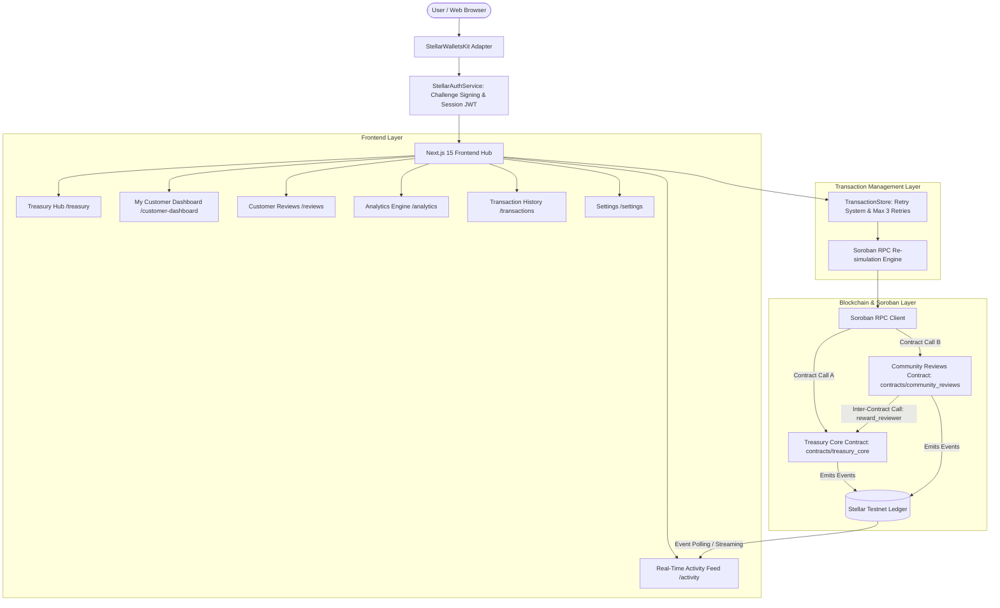

# Community Treasury Management & Governance Platform

A production-grade decentralized **Community Treasury Management & Governance Platform** built on the Stellar blockchain with Soroban smart contracts. It features dual smart contracts with **Inter-Contract Communication**, milestone-based grant escrow disbursal, wallet-based cryptographic authentication, personal customer dashboards, real-time ledger event streaming, a smart **Transaction Retry Mechanism**, Vitest & Rust test suites, and GitHub Actions CI/CD pipelines.

---

## 📐 Architecture Diagram



---

## 🌟 Key Features Implemented

### 1. Milestone-Based Grant Escrow Disbursal
- **Tranche Release Protocol**: Grants are structured into 1 to 5 milestone tranches (e.g. 4 milestones of 2,500 XLM for a 10,000 XLM proposal).
- **Progress Tracking & Controls**: Treasury proposals display milestone progress indicators and "Release Next Milestone" action triggers.
- **Soroban Smart Contract**: `release_milestone(env, executor, proposal_id)` method disburses individual milestone tranches to grant recipients as deliverables are completed.

### 2. Wallet-Based Authentication & Personal Customer Dashboard (`/customer-dashboard`)
- **Cryptographic Challenge Authentication**: Users sign a unique nonce challenge via StellarWalletsKit to prove public key ownership (no separate passwords).
- **Session Persistence**: Secure session tokens stored in local storage and refreshed on reconnect.
- **My Customer Dashboard**: Personal portal tracking user's deposits, proposals created, votes cast, customer reviews submitted, reviewer rewards earned, and editable off-chain profile.
- **Action Gating**: Write operations require an active authenticated session; read access remains fully public.

### 3. Smart Transaction Retry System
- **Automatic Simulation Re-Run**: Re-simulates Soroban RPC invocation before resubmitting failed transactions (handling sequence errors, network hiccups, or fee estimates).
- **Retry Count Management**: Tracks `retryCount` up to a maximum cap of **3 attempts** per transaction.
- **Failure Transparency**: Surfacing human-readable failure reasons in both floating toasts and the `/transactions` ledger center.

---

## 🧪 Running Tests

### Frontend Unit & Integration Tests (Vitest)

```bash
npm run test
```

### Soroban Smart Contract Tests (Rust)

```bash
cd contracts/treasury_core
cargo test

cd ../community_reviews
cargo test
```

---

## ⚙️ Environment Variables

Create `.env.local`:

```env
NEXT_PUBLIC_STELLAR_NETWORK=testnet
NEXT_PUBLIC_STELLAR_RPC_URL=https://soroban-testnet.stellar.org
NEXT_PUBLIC_STELLAR_NETWORK_PASSPHRASE="Test SDF Network ; September 2015"
NEXT_PUBLIC_STELLAR_EXPLORER_URL=https://stellar.expert/explorer/testnet
NEXT_PUBLIC_CONTRACT_ID=CB67890TREASURYCONTRACTIDSTELLARTESTNETDAPPDEMO
STELLAR_ADMIN_SECRET_KEY=SDEMOADMINSECRETKEYFORLOCALDEVELOPMENTTESTINGONLY
```

---

## 📌 Contract Addresses & Links

- **Treasury Core Contract**: `CONTRACT_ADDRESS_PLACEHOLDER`
- **Example Transaction Hash**: `TRANSACTION_HASH_PLACEHOLDER`
- **Demo Video**: `DEMO_VIDEO_LINK_PLACEHOLDER`
- **Live Demo App**: `LIVE_DEMO_PLACEHOLDER`
